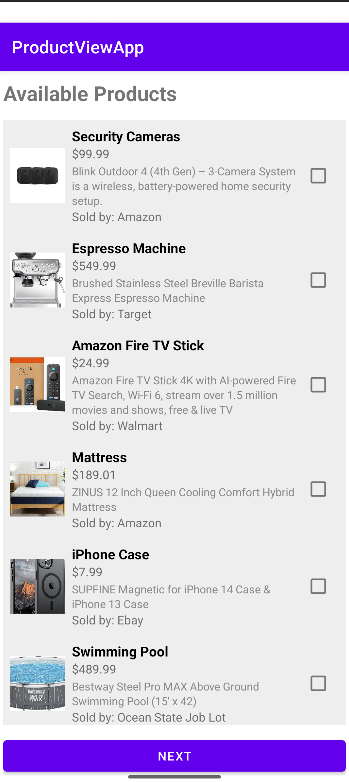
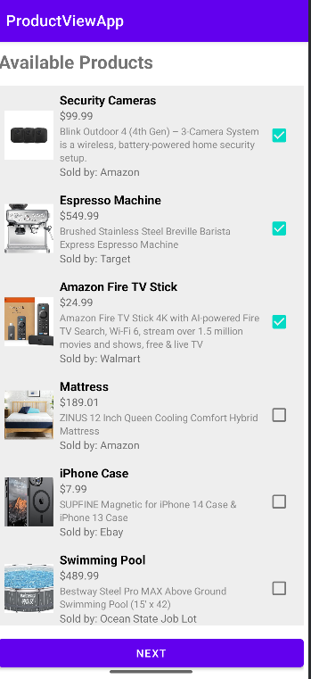
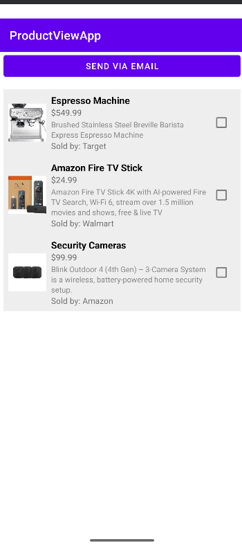
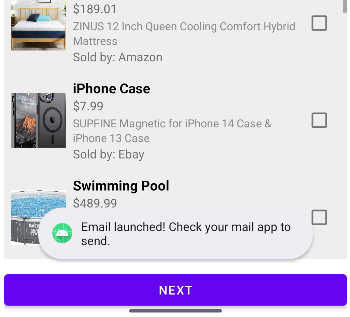
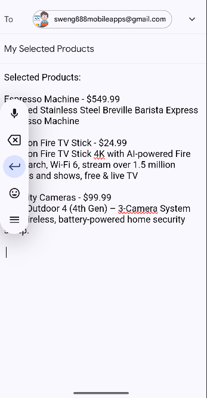
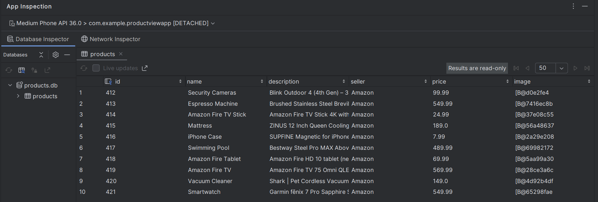

# Product View App 📱

This is an Android application for browsing and selecting products from a local SQLite database. Users can select multiple products and navigate to a second screen to see their choices.

---

## ✨ Features

- Displays a list of products with:
  - Name
  - Description
  - Price
  - Seller
  - Image
- Allows selecting products with checkboxes
- Requires selecting at least **3 products** to proceed
- Passes selected products to the next screen using Parcelable
- Fully offline—no network access needed

---

## 🚀 How to Build and Run

1. **Clone the repository**

`git clone https://github.com/Chazdj0510/ProductViewApp.git`

2. **Open in Android Studio**

  - Launch Android Studio.
  - Choose **Open an existing project**.
  - Select the project folder you cloned.

3. **Sync Gradle**

  Android Studio should automatically sync Gradle. If not, click **File > Sync Project  with Gradle Files**.

4. **Build the project**

  - Click **Build > Make Project**.

5. **Run on emulator or device**

  - Connect a device or launch an emulator.
  - Click the green **Run** button.

---

## 📝 Usage

1. **Launch the app.**
2. The product catalog will be shown in a scrollable list.
   - 
4. Tap the checkboxes to select products.
   - 
6. After selecting at least 3 products, tap the **Next** button.
8. The app navigates to the next screen to display your selections.
   - 
9. To share your selection, tap the **Send via Email** button:
   - This opens your email app with the product details pre-filled.
   - Choose the recipient and send the email.
   - 
   - 

---

## 🛠️ Project Structure

- `activities/`  
Contains `MainActivity` (product list) and `SecondActivity` (selected products).
- `adapters/`  
`ProductAdapter` binds product data to RecyclerView.
- `database/`  
`ProductDatabaseHelper` manages SQLite operations.
- `models/`  
`Product` model class implements `Parcelable`.
- `res/layout/`  
XML files for UI (`activity_main.xml`, `item_product.xml`, etc.).
- `res/drawable/`  
Product images and placeholders.

---

## ⚠️ Notes

- All product data is stored locally in SQLite.
- The database is **reset and repopulated** every time `MainActivity` starts.
- Product images are stored as byte arrays (BLOB).
- To view the database click **View > Tool Windows > App Inspection
  

---

## ✏️ Customization

To modify products or images:

- Edit the `populateDatabase()` method in `MainActivity.java`.
- Update images in `res/drawable`.
- Update strings in `res/values/strings.xml`.

---

## 🧑‍💻 Author

Created by **Chastidy Joanem**  
GitHub: @chazdj0510(https://github.com/chazdj0510)
